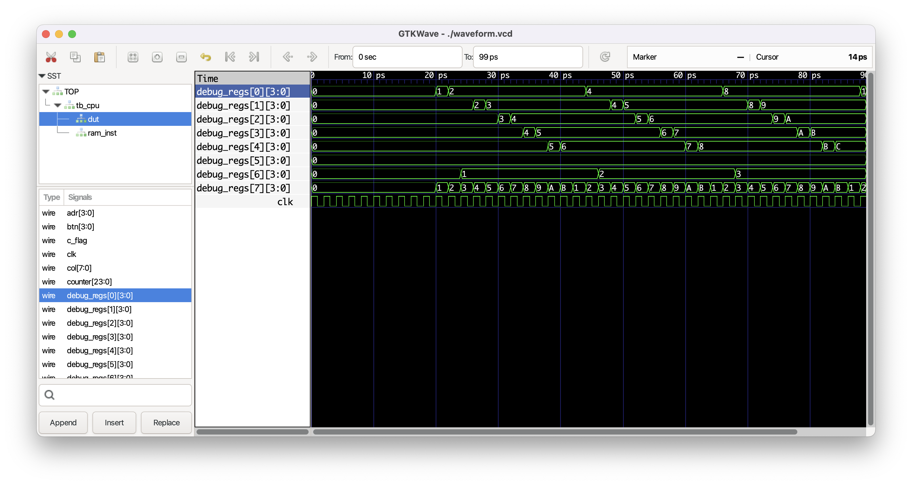

# Tang Nano 4bit CPU with 8x8 LED Matrix

## About

* [DL166](https://github.com/imaoca/dl166) 4bit CPU implementation for Tang Nano 20K
* With a test bench example for Verilator
* With a wave output example for Verilator & Gtkwave
* Please refer to the great [Monoist articles](https://monoist.itmedia.co.jp/mn/series/33743/) for more details


## How to run

### Prereq

* brew install verilator
* clone and build gtkwave at https://github.com/gtkwave/gtkwave

### Test Bench

```bash
make clean
make run
make wave
```


