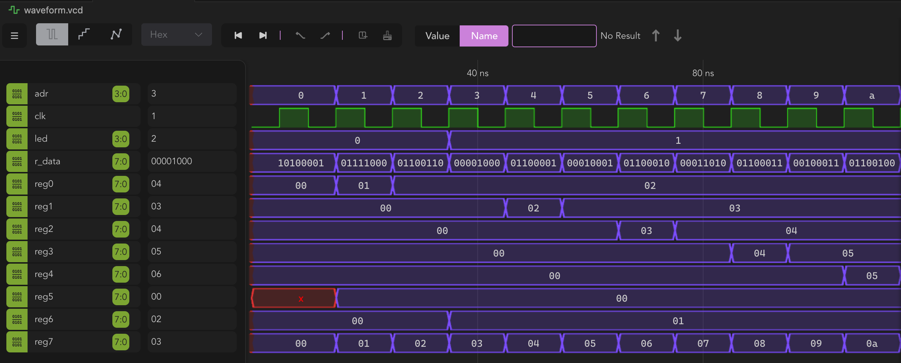

# Tang Nano 4bit CPU with 8x8 LED Matrix

## About

* [DL166](https://github.com/imaoca/dl166) 4bit CPU implementation for Tang Nano 20K
* With a test bench example for DSim Desktop
* With a wave output example for DSim Desktop
* Please refer to the great [Monoist articles](https://monoist.itmedia.co.jp/mn/series/33743/) for more details


## How to build

```bash
# On macos
make clean
make
make download
```

## How to test

* Run DSIM Desktop on Linux x64 through VS code remote


